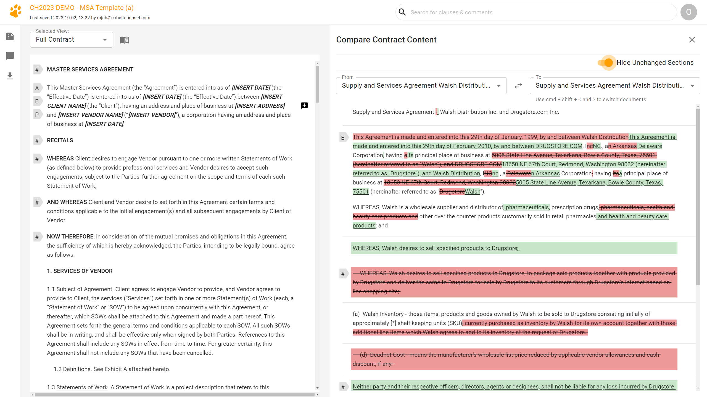
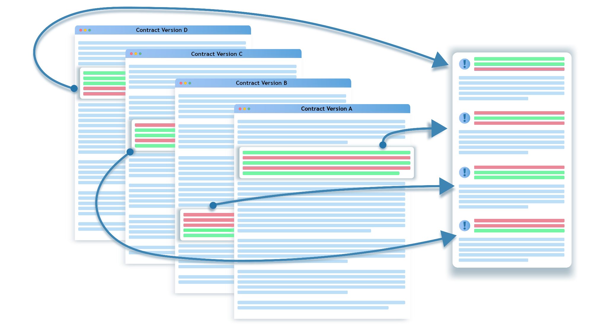
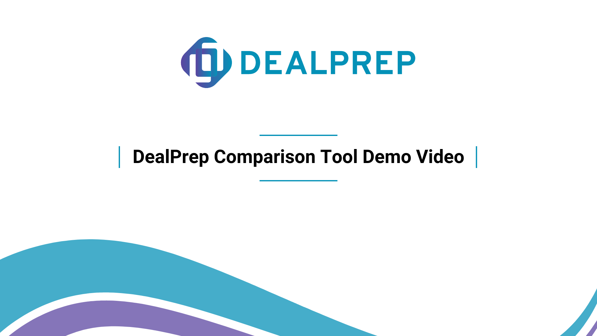

## Our Problem

Comparing documents and document versions is a highly beneficial review activity for lawyers, but one that, over a legal career, incurs many tedious, laborious hours. It can require legal teams to meticulously scour through hundreds of individual files of source/target and redline documents. Even with our tool DealPrep, document comparison is a massive part of our workflow when conducting deal document review for our clients. We've felt the pains of differences in formatting, file type conversions, naming conventions, etc. We also realized how much time our team spends switching between documents and retrieving documents for comparison purposes. Eventually, we decided to come up with a better solution to the traditional redline comparison tools that we could integrate into our DealPrep platform.

Our solution had four essential requirements:

(1) Include comparison tool;

(2) Allow many to many document review that can collect hundreds of documents;

(3) Enhanced toolsets, such as comment comparison between documents;

(4) Seamlessly integrates into our existing DealPrep platform.

DealPrep's Compare tool is used by our clerks to quickly compare documents via redline. With easy access to other documents and reference materials, and the ability to hide unedited clauses/sections when comparing documents, the comparison tool speeds up our clerks' deal document workflow by 33%.

## Our Tech Challenges

In order to develop these high quality tools, our software development team worked closely with the clerks to optimize their workflow each step of the way. With DealPrep's power came extra processing requirements, where we had to avoid a clunky-feeling interface while it was calculating large sets of document comparisons. More processor-intensive code was moved out of the main thread, into a separate background thread using a web worker. This allowed big operations to happen without our end-users feeling like the interface was freezing.

Our team also hit limits in document storage and retrieval with the huge number of simultaneous comparisons we wanted to do, which could be multiple drafts of hundreds of documents. We refactored how our data was stored in order to scale in document manipulation. This was accomplished through the Rust implementation, as well as numerous improvements to the frontend renderer. Typical web page rendering was insufficient, and many long lists were replaced with virtualized renderers. We would avoid heavy processing in the web browser by only putting content in the browser if it was going to be visible. This change also allowed the interface to read data across multiple tabs, allowing the user to work on multiple documents at one time. Our virtualization and web workers were successful enough that we could run thousands of comparisons at once, even on less powerful hardware (e.g. tablets and old laptops), where we'd previously struggled with dozens of compares.

The final hurdle we faced was with our most computationally expensive code: the diffing algorithm. While the old diffing code was fine for two documents at a time, now that we could compare thousands at a time, we were going to. As we grew more bold in our comparison sizes, we started seeing 30 seconds and higher startup cost when running the diff. The original diffing code was written in TypeScript and running as JavaScript, which is a fine language for the majority of web applications that mostly wait on external things: database queries, webservice calls, user inputs, etc. With these large-scale diffs we found the web application code itself became a major bottleneck. Our backend code has long been Rust, so we were aware of the major performance gains possible. We created another web worker that ran Rust compiled to WebAssembly. For the beta version, the Rust diffing code was an almost direct translation of the TypeScript code. While many Rust devs would consider this suboptimal Rust code, in practice it still ran 8x as fast as the TypeScript it replaced. By the time the new diff launched in production, it ran so quickly (and in the background) that the diffs came up instantly.

Legal documents aren't stored and managed the same as flat text, as what we're diffing against isn't just raw text, but identifying changes inside of specific types of clauses. We tag documents by clause concept when ingesting them, which lets us compare multiple documents around the same clause category. This is a key value of our platform, so we needed to ensure that those tags are preserved when interacting with them in the comparison interface. This meant most of the diffing algorithms needed to be written from the ground-up. To do so, we implemented logic into our algorithm that created a list of all the clauses in one contract, and all the clauses in a second contract. Let's call them "Contract A" and "Contract B". In order to find out if the text is a match, normally you would just compare one section from "Contract A" with one section from "Contract B" and if they don't match then you move on.

However, given deal documents are constantly changing, and there's a lot of nuances to be captured, our tech needed to be able to find matches based not only on matching text but matching legal concepts. This is where CobaltAI succeeds as a company: the legal side is working every day with the developers, iterating and understanding the problem we're solving together. The schema we've developed is based on how actual lawyers and law clerks approach contract review. We capture not only those tags, but even the discussion behind them, capturing how the decision to include that clause language was made in every contract it was made in.

## A New and Improved User Experience

This new algorithm, combined with our refactoring of the data storage, and the transition to the WebAssembly programming language has many new benefits. Some of these include our ability to run redlines against an entire document library, which can be up to hundreds of documents.
Another major benefit to mention is that unlike traditional word processing comparison tools, our comparison tool offers the ability to hide unchanged sections. Our team often works on documents that are 30+ pages in length, containing multiple appendices or addendums, and round after round of negotiation comment threads and redlines. When working at high velocity and with strict time allocations for each matter, our team benefits greatly from the ability to hide all unchanged clauses/sections so that we may focus on only what's still in negotiation. You can check out these new tools in action in the video below:

### 
[Click for Video Demo](https://vimeo.com/886962695?share=copy)

&nbsp; 

An interesting benefit to note from our tool being built in our existing interace, instead of creating a MS Word add-on or Google Docs add-on, is that our team never needs to change tabs, windows or use any other platform. With all of our precedents and reference materials in one place and the ability to run redlines on any and all of those documents in one view, our team is no longer overwhelmed with organization of files and can now just focus on the review task at hand.

As an example, we recently used the comparison tool in a project where we had to compare incoming contract documents with a playbook we created for a client. Our interface scanned all the incoming documents, and our comparison tool allowed us to instantly see any new or outlying language in the incoming documents, so we could make edits and alert our client.

Another recent example is when a client needed us to vet a large batch of NDA's based on an NDA template in their procurement tender documents sent to contractors. This led to a large influx of NDA's coming to our client, and instead of laboriously going through each NDA and vetting it, we were able to feed all of the incoming NDA's and the template they were based on into our DealPrep platform. Doing so allowed us to compare the whole batch with the template seamlessly, and we could quickly tell if the batch of agreements matched the original template. The entire process took about twenty minutes, as we simply had to check in our interface if the documents were a match

Our team is truly excited about the strides we've made in simplifying and enhancing the document comparison process. We're always striving to innovate and solve problems creatively. We hope you've enjoyed learning about our journey to make legal document review a smoother experience. If you have any questions or thoughts, feel free to [reach out](https://dealprep.co/#contactAnchor) – we're here to chat!
